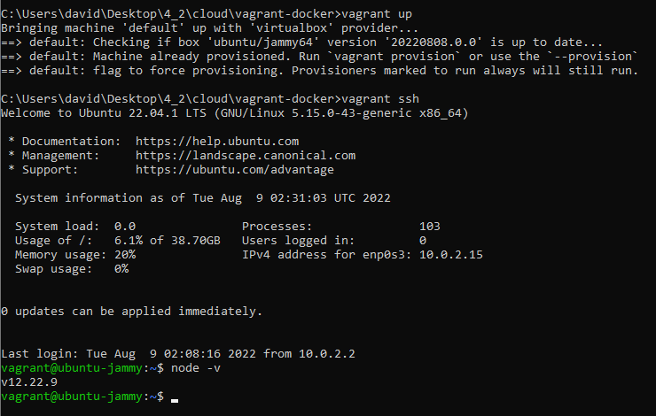
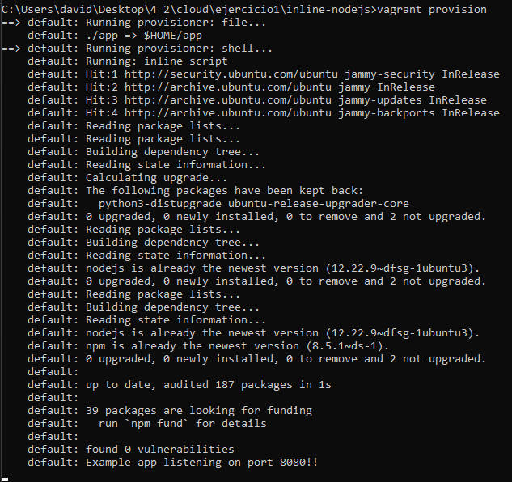

# Con inline
0. Poner en línea de comando ´´´vagrant init´´´ esto creará un archivo llamado Vagrantfile.
1. Primero definiremos la version de linux a usar: en este caso será la ubuntu/jammy64.
2. Indicamos al Vagrantfile la version de linux con la provision de comandos para instalar nodejs.
´´´
apt-get update
apt-get upgrade
apt-get install -y nodejs 
apt-get install -y nodejs npm
cd app 
npm install
node app.js
´´´
3. El vagrantfile se verá así:
´´´
config.vm.box = "ubuntu/jammy64"
  config.vm.provision :file, source: './app', destination: "$HOME/app"
  config.vm.provision "shell",
    inline: "
    apt-get update
    apt-get upgrade
    apt-get install -y nodejs 
    apt-get install -y nodejs npm
    cd app 
    npm install
    node app.js
    "
´´´
4. Despues con el comando ´´´vagrant up´´´ levantamos la máquina y se empieza a bajar la imagen además de instalar nodejs. Despues de aproximadamente 10 minutos tendremos finalmente la máquina con nodejs instalado.
5. Al meter a la línea de comando ´´´vagrant ssh´´´ podremos meternos a la línea de comando de la máquina recien creada. Al ingresar ´´´node -v´´´ nos imprimirá la versión.

6. Para correr solo se debe de poner 'vagrant up' y se correrá.

# Con ansible
